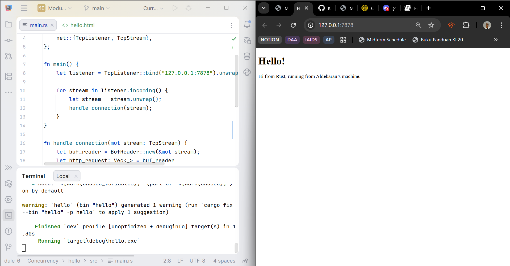
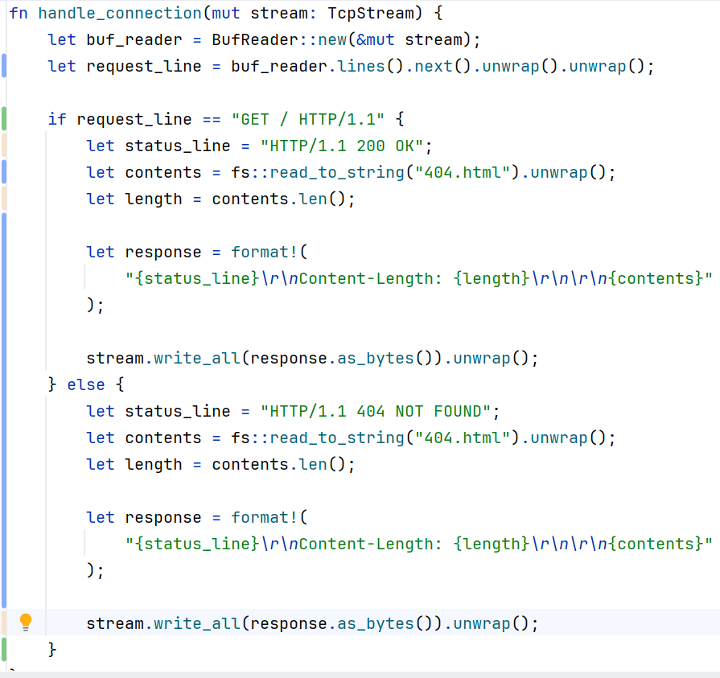
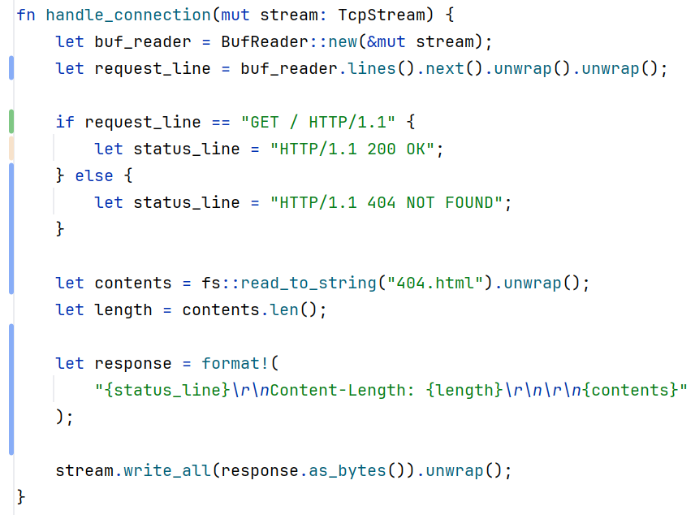

# Commit 1 Reflection Notes
The code so far successfully initializes a web server by binding a TcpListener to the local network address 127.0.0.1 on port 7878.
The bind function returns a Result type and the utilization of unwrap() acts as a way to handle errors where it panics on purpose and terminates the program if the port is already occupied by another process.
When a listener is active, it iterates over incoming TcpStream connections from the client which is the web browser.
Inside the handle_connection function, a BufReader is used to wrap the mutable stream. This is important because it buffers the raw byte reads from the network which prevents the system from making a number of inefficient micro-calls to the operating system.
By mapping over the buffered lines and collecting them into a vector, the program efficiently parses the raw text of the HTTP request, allowing us to see the GET / HTTP/1.1 method and the associated headers.
Overall, this milestone demonstrates the mechanics of how a server intercepts raw TCP network traffic and prepares it for application-level processing.

# Commit 2 Reflection Notes

**Figure 1:** Milestone 2 Commit Image.

In this milestone, the server's capability is expanded to actually read web content than just reading incoming requests.
To achieve this, the std::fs module is needed which allows the Rust program to read contents of the local hello.html file directly into a string variable.
The HTML content is then dynamically formatted to be compatible with HTTP's response payload.
A valid HTTP response requires a specific syntax with structure, beginning with a status line, which in this implementation is HTTP/1.1 200 OK to signify a successful network request.
Additionally, the Content-Length header is dynamically calculated using the len() method on the file contents, which is an important standard protocol that lets the receiving web browser know exactly how many bytes to expect.
Finally, the complete string is converted into an array of raw bytes and written back to the TcpStream using the write_all method.
The completion of this step allows the application to demonstrate a full request-response lifecycle by successfully serving a customized, static HTML file over a TCP connection.

# Commit 3 Reflection Notes

**Figure 2:** Milestone 3 state before the refactor.

**Figure 3:** Milestone 3 state after the refactor.

In this milestone, the functionality of the server is enhanced by adding basic routing logic to respond with the appropriate webpage based on the client's request.
The handle_connection function is updated to only extract the first line of the HTTP request, which contains the method and URI, to determine what webpage the user is trying to access.
By using conditional statements, the server checks if the request line exactly matches GET / HTTP/1.1. If the condition is satisfied, the server sends the 200 OK status and the hello.html file. If not, then the server sends a 404 NOT FOUND status and loads the 404.html file.
Originally, the code implemented was quite verbose and needed to be optimized using the DRY principle. Instead of writing the file reading, calculating length, and formatting a response is done twice for each case of the response. Now, the program has been optimized to only calculate the values that differ (status_line and filename) from each case (either 200 OK or 404 NOT FOUND).
The refactored code now improves the maintainability of the project which ensures that future modifications to the response formatting only need to be edited in one place.

# Commit 4 Reflection Notes
In this milestone, now the server is modified to simulate a slow response by introducing a /sleep endpoint. To better handle multiple routing paths, the previous if-else conditional is refactored into a match expression which is suitable for Rust which has pattern matching against strings.
When a client requests /sleep path, the server runs a thread::sleep to pause the execution of the program for at least 10 seconds before actually displaying the hello.html file. Since the current project runs on a single thread, the sleep operation basically blocks the main execution thread.
This implies that if a second request is made to the website (specifically the root path /) while the first request is still sleeping, the second request must wait in a queue until the sleep duration finishes. This part of the module demonstrates the critical bottleneck of a single-threaded web server, as one slow request of heavy computational task effectively freezes the application for all other concurrent users.
A better implementation would be to implement a multithreaded architecture instead to serve more users.